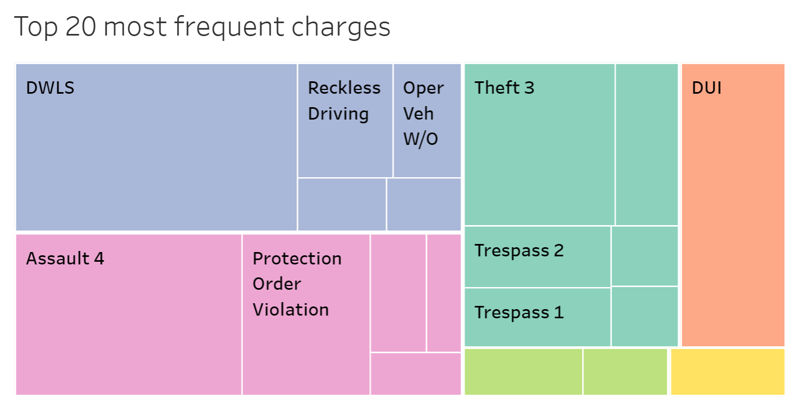

Questions
What are the most common case types?
What are the most common outcomes (Result)?
Do outcomes vary by case type?
Which locations have the most cases?
Are there patterns over time (Start date)?

Most common case type: Misdemeanor Non Traffic — 8,772 records

Most common status: Open — 3,857 records
Most common location: Courtroom B — 3,305 records
Most common hearing type: Pretrial Conference — 2,680 records
Most common result: Cancelled — 2,722 records
Date range: March 2, 2026 to April 22, 2026

This dataset contains 12,065 Spokane court records from March 2, 2026 through April 22, 2026. The most common case type is Misdemeanor Non Traffic, which makes up the majority of the dataset with 8,772 records. The most frequent case status is Open, showing that many cases in the dataset had not yet reached a final resolution. Courtroom B appears most often as the listed location, followed by Courtroom A and the Library Community Court. The most common hearing type is Pretrial Conference, and the most common result type is Cancelled. Overall, the data suggests that Spokane court activity during this period is heavily centered around misdemeanor non-traffic cases, pretrial hearings, and cases that are still moving through the court process.

Washington Court Data Analysis with Malloy

For this project, I chose to work with Spokane court data because of my involvement with Spokane Community Against Racism (SCAR), where I have spent time sitting in and observing court proceedings over the past couple of months. Through that experience, I was able to see how cases move through the system in real time, but I also realized how difficult it is to understand larger patterns just from observation alone. That is what motivated me to take this dataset and analyze it using Malloy—to connect what I was seeing in person with a more structured, data-driven perspective.

I started by importing the dataset into DuckDB through Malloy and previewing the data to understand what fields were available. The dataset included information such as case status, location, case type, result type, and start date. These were all things I had seen while sitting in court, but having them organized in a dataset allowed me to step back and look at trends instead of just individual cases.

The first question I explored was what types of cases appeared most frequently. After grouping the data by case type, I found that misdemeanor non-traffic cases made up the majority of the dataset. This aligned with what I had observed in court, where many of the hearings I sat in on involved lower-level offenses rather than major criminal cases. Seeing that pattern confirmed that my personal observations were part of a larger trend.

Next, I became curious about how these cases were being resolved. I grouped the data by result type and found that outcomes like cancellations and ongoing/open cases appeared frequently. This stood out to me because, while sitting in court, I often noticed how many cases did not reach a final resolution during a single hearing. The data helped reinforce that this wasn’t just a one-time observation—it was a consistent pattern.

To go deeper, I combined case type and result type to see if certain types of cases were more likely to lead to specific outcomes. This was one of the most interesting parts of the project because it revealed relationships that are difficult to see just by watching court sessions. Some case types appeared to have more predictable outcomes, while others showed more variation. This helped me better understand how different types of cases move through the system.

I also looked at where cases were taking place. By grouping the data by location, I found that certain courtrooms handled a higher volume of cases. This matched my experience with SCAR, where I frequently observed sessions in specific rooms that seemed consistently busy. It showed how activity is not evenly distributed, even within the same court system.

Finally, I explored trends over time using the start date. While the dataset only covered a short period, it still gave some insight into how case volume changes day-to-day. This added another layer to my understanding by connecting individual court experiences to broader patterns across time.

One of the biggest challenges in this project was working with messy data. The dataset included duplicate column names and inconsistent formatting, which required troubleshooting before I could run queries. While frustrating at times, this was also one of the most valuable parts of the project because it showed how real-world data is rarely clean and how important it is to prepare data properly before analysis.

Overall, this project helped me connect my real-world experience with SCAR to technical skills in data analysis. Instead of just observing individual cases, I was able to step back and identify patterns across thousands of records. Malloy made it possible to explore those patterns in a structured and meaningful way.

Why This Matters

These findings could be useful for community organizations like SCAR, as well as researchers and policymakers who are interested in understanding how the court system operates in practice. By identifying patterns in case types, outcomes, and locations, this type of analysis can provide more context to what is happening in courtrooms on a day-to-day basis. It can also help inform conversations around efficiency, accessibility, and fairness in the legal system. For organizations involved in court observation and accountability work, combining direct observation with data analysis creates a more complete and impactful understanding of the system.

link to public tableau: https://public.tableau.com/app/profile/wsccr/viz/shared/J579W6PXM
